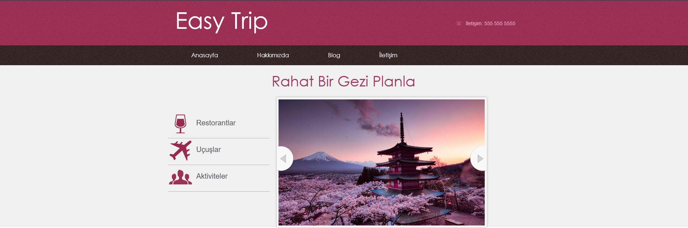
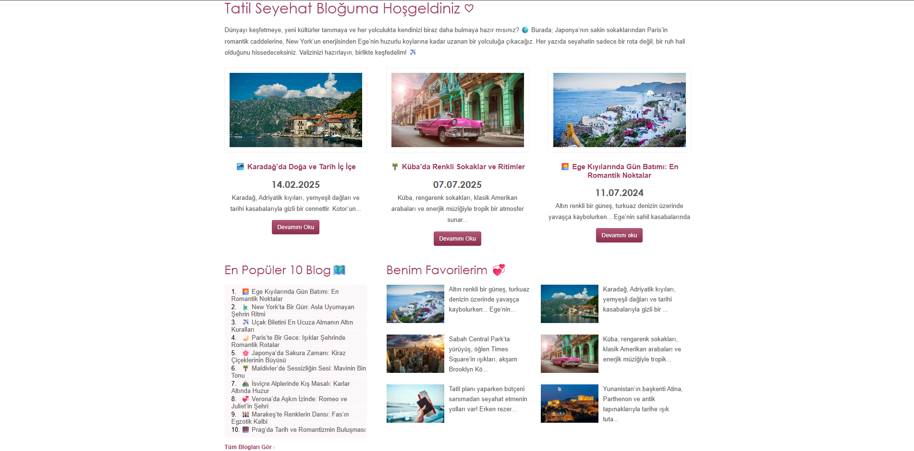
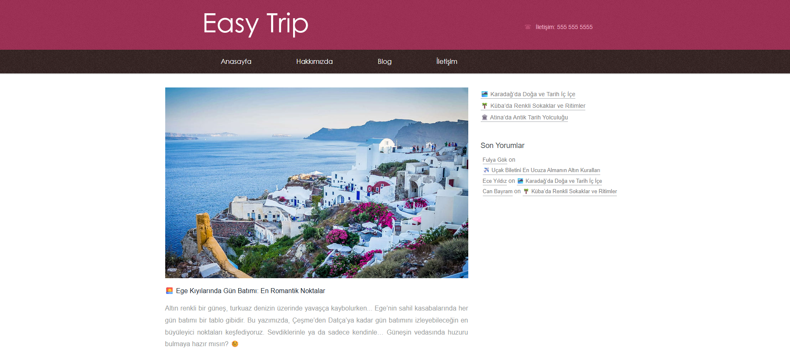
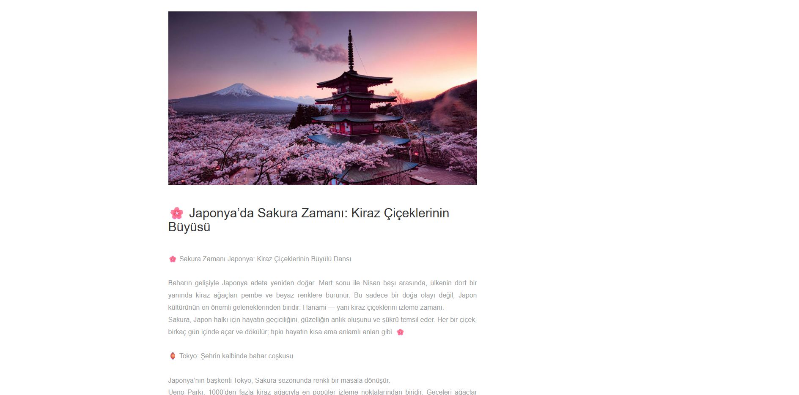
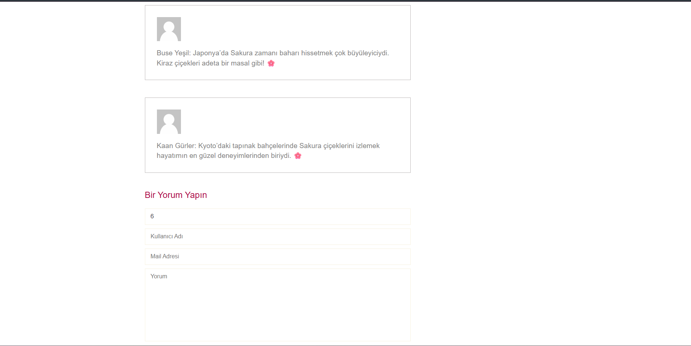
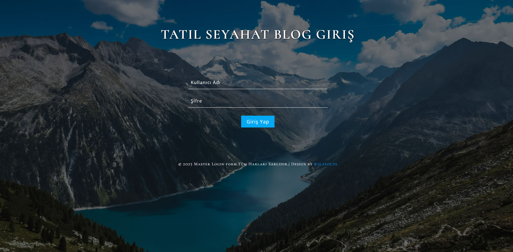
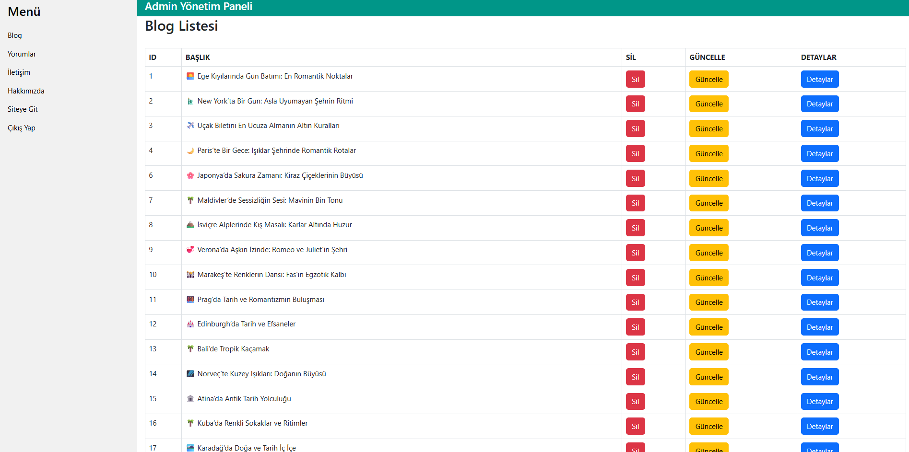

 ✈️ Tatil Seyahat Blog - Easy Trip

**ASP.NET MVC ile geliştirilmiş, seyahat tutkunları için dinamik blog platformu. Kullanıcılar dünya çapındaki seyahat deneyimlerini paylaşabilir, yorumlar yapabilir ve ilham alabilir.**

📸 Proje Görselleri

🏠 Ana Sayfa - Slider Bölüm

****

 📱 Ana Sayfa - Blog Kartları

****

 📝 Tüm Bloglar Sayfası

****

 📖 Blog Detay Sayfası

****

 💬 Yorum Sistemi

****

ℹ️ Hakkımızda

****

🔐 Admin Giriş Paneli

****

 👨‍💼 Admin Paneli - Blog Yönetimi

****

✨ Özellikler

 🌐 Kullanıcı Paneli

**- \*\*Dinamik Blog Slider\*\*: Ana sayfada otomatik dönen blog görselleri**

**- \*\*Blog Keşfi\*\*:** 

  **- Tüm blogları listeleme**

  **- Blog detay sayfası ile tam içerik okuma**

  **- Tarih, başlık ve açıklama bilgileri**

**- \*\*İnteraktif Yorumlar\*\*:** 

  **- Blog yazılarına yorum yapabilme**

  **- Kullanıcı adı, mail ve yorum içeriği**

  **- Her blog altında yorumların görüntülenmesi**

**- \*\*Dinamik İçerik Bölümleri\*\*:**

  **- En Popüler 10 Blog 🗺️**

  **- Benim Favorilerim 💞**

  **- Son Yorumlar**

**- \*\*Hakkımızda Sayfası\*\*: Platform ve yazar bilgileri**

 👨‍💼 Admin Paneli

**- \*\*Blog Yönetimi\*\*:**

  **- Yeni blog ekleme**

  **- Mevcut blogları düzenleme**

  **- Blog silme**

  **- Blog görsel yükleme**

**- \*\*Yorum Moderasyonu\*\*:**

  **- Tüm yorumları görüntüleme**

  **- Yorumları düzenleme veya silme**

  **- Hangi bloga ait olduğunu görebilme**

**- \*\*Hakkımızda Yönetimi\*\*:**

  **- Hakkımızda içeriğini güncelleme**

  **- Fotoğraf URL'lerini düzenleme**

**- \*\*Güvenli Giriş Sistemi\*\*:**

  **- Admin authentication**

  **- Session yönetimi**

  **- Güvenli çıkış**

🎨 Tasarım Özellikleri

**- \*\*Responsive Design\*\*: Mobil, tablet ve desktop uyumlu**

**- \*\*Modern UI\*\*: Kullanıcı dostu arayüz**

**- \*\*Dinamik Slider\*\*: Otomatik ve manuel geçişli görsel slider**

**- \*\*Temiz Layout\*\*: Kolay gezinilebilir menü yapısı**

 🛠️ Kullanılan Teknolojiler

Backend

**- \*\*ASP.NET MVC 5\*\* - Web framework**

**- \*\*Entity Framework\*\* - ORM (Code First yaklaşımı)**

**- \*\*C#\*\* - Programlama dili**

**- \*\*LINQ\*\* - Veri sorgulama**

**- \*\*SQL Server\*\* - Veritabanı**

Frontend

**- \*\*HTML5 \& CSS3\*\* - Yapı ve stil**

**- \*\*JavaScript \& jQuery\*\* - İnteraktif özellikler**

**- \*\*Responsive Slides\*\* - Slider komponenti**

**- \*\*Bootstrap\*\* - Admin paneli için**

Güvenlik
**- \*\*Forms Authentication\*\* - Kullanıcı doğrulama**

**- \*\*Session Management\*\* - Oturum yönetimi**

**- \*\*Authorize Attribute\*\* - Yetkilendirme**

 📊 Veritabanı Yapısı

 Tablolar

Blog

**- ID, Baslik, Tarih, Aciklama, Icerik, BlogImage**

Yorumlar

**- ID, KullaniciAdi, Mail, Yorum, BlogId (Foreign Key)**

Admin

**- Id, Kullanici, Sifre**

Hakkimizda

**- ID, FotoURL, Aciklama**

İletişim

**- ID, AdSoyad, Mail, Konu, Mesaj**

 🚀 Kurulum

**### Gereksinimler**

**- Visual Studio 2019 veya üzeri**

**- .NET Framework 4.7.2+**

**- SQL Server 2014 veya üzeri**

**- IIS Express (Visual Studio ile birlikte gelir)**

 🎯 Kullanım

 Kullanıcılar İçin

**1. Ana sayfadan blogları keşfedin**

**2. İlginizi çeken bir blog'a tıklayın**

**3. Blog detayını okuyun**

**4. Sayfanın altından yorum yapın**

**5. "En Popüler 10 Blog" ve "Favorilerim" bölümlerinden önerileri inceleyin**

Admin İçin

**1. `/GirisYap/Login` adresinden giriş yapın**

**2. Sol menüden istediğiniz yönetim sayfasına gidin:**

   **- \*\*Blog\*\*: Yeni blog ekle, düzenle, sil**

   **- \*\*Yorumlar\*\*: Yorumları görüntüle, düzenle, sil**

   **- \*\*Hakkımızda\*\*: İçeriği güncelle**

**3. İşlemlerinizi tamamladıktan sonra "Çıkış Yap" butonuna tıklayın**

 📝 Öne Çıkan Blog Konular

**Projede yer alan bazı blog yazıları:**

**- 🏖️ Ege Kıyılarında Gün Batımı: En Romantik Noktalar**

**- 🗽 New York'ta Bir Gün: Asla Uyumayan Şehrin Ritmi**

**- ✈️ Uçak Biletini En Ucuza Almanın Altın Kuralları**

**- 🥐 Paris'te Bir Gece: Işıklar Şehrinde Romantik Rotalar**

**- 🌸 Japonya'da Sakura Zamanı: Kiraz Çiçeklerinin Büyüsü**

**- 🌴 Maldivler'de Sessizliğin Sesi: Mavinin Bin Tonu**

📞 İletişim

**Proje Sahibi: BUSE YEŞİL**

**- Email: buseyesil55@gmail.com**

**- LinkedIn: https://www.linkedin.com/in/buse-y-5b3073249/**

🌍 Mutlu geziler! ✈️

